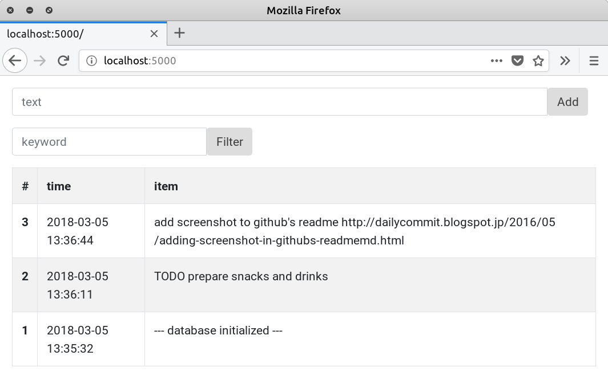

# Memo.py, a flask+bootstrap+sqlite3 memo app.

(A sample program in a paper. Not a practical app.)

## To run

Create a database file.

```
python3 memo.py init
```

A database file `~/.memo.py/database.db` is generated with the above command.

Run the memo app server.

```
python3 memo.py
```

## Screenshots


